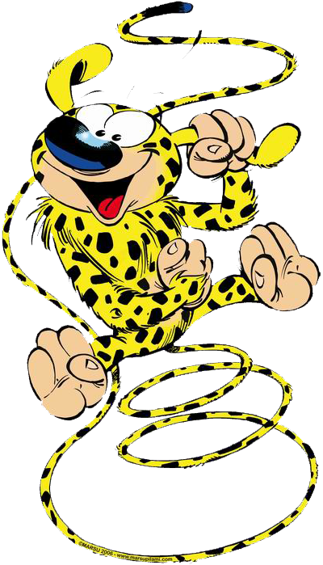

Welcome to Marsupilami's documentation !
=======================================

Marsupilami est un solver pour le formfinding et le calcul des structures du Génie Civil basé sur des méthodes de dynamique explicite.

Marsupilami permet de faire aussi bien de la dynamique (avec schéma d'intégration explicite) que du calcul statique (par dynamique explicite amortie, telle la relaxation dynamique avec amortissement cinétique ou visqueux).

Positionnement :

 - rigueur scientifique
 - open source
 - contributif
 - hebergé sur GitHub
 - documenté sur Read The Docs
 - intégration ciblée pour Rhino et Grasshopper

The main documentation for the site is organized into a couple sections:

* :ref:`user-doc`
* :ref:`developer-doc`

.. _user-doc:

.. toctree::
   :maxdepth: 2
   :caption: User Documentation

   getting_started.rst
   tutorial.rst
   theory.rst

.. _developer-doc:

.. toctree::
    :maxdepth: 2
    :caption: Developer Documentation

    development.rst
    autodoc.rst
    api.rst

Indices and tables
==================

* :ref:`genindex`
* :ref:`search`
